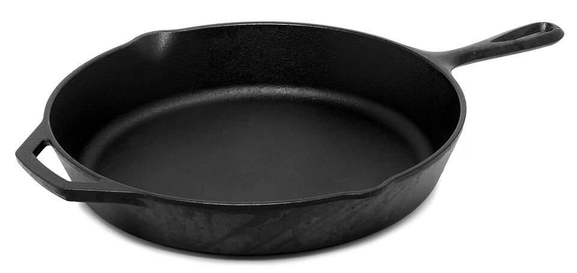

A common question in product interviews are "What makes a good product?" or "What's your favorite product and why?" My go-to answer has always been the Kayak app. I found it so cool that you can forward emails to it and then it will read those emails and assemble an itinerary and send you reminders about your flights. After spending more time in product management, I've gained a certain appreciations for products and features that seemed almost ad-hoc and hacky at first but ended up giving you way more mileage than you expected. In a previous role, we needed a way to record patterns of blood pressures and weights that were concerning for CHF exacerbation. The solution at the time was to stand on a scale, then stand on the scale again holding a weight. It became more challenging as we built logic to track those patterns over days and weeks. I ended up coding a device simulator using R Shiny that allowed a user to specify a reading and a timestamp. 4 years later, this tool is still a staple for the QA team's testing. And the flexibility of that tool allowed us to easily simulate months of patient monitoring during end-to-end integration testing with external partners.

I'm proud of my 4+ years tool that I built. That's a long time in a scrappy startup. But there are some products that have truly transcended time and challenges from constant innovation.

### The Cast Iron Skillet: Centuries of Searing

Cast iron skillets have been around for hundreds of years. They have their weird seasoning process to keep them non-stick and they're terribly heavy. But my cast iron has a constant home on my stovetop and is my most-used kitchen appliance--eggs, meats, grilled cheese, fritatas, cornbread--anything. Since their introduction, we have seen stainless steel, Teflon, ceramic, and other materials. Somehow, some of us keep finding our way back to cast iron. Its thermal mass is unparalleled. It is virtually indestructible, and it gets better with age.

### Penicillin G: The Gold Standard Against Syphilis

In medicine, Penicillin G—the very first antibiotic—is still the gold standard treatment for syphilis. Despite the development of so many other antibiotics over the last 80 years, *Treponema pallidum* has never developed significant resistance to it. For this specific disease, the original discovery remains the most effective, most targeted, and most reliable treatment available.   

### Vinyl Never Dies

It surprises me that people still own and listen to vinyl records. Honestly, I don't think my ears can detect much of a difference between vinyl records, mp3s, and CDs, but audiophiles will continually tinker with the different stages of analog signal processing to get a sound that truly resonates with them (pun intended). Records have also had a resurgence among the Gen Z folks wanting to unplug from all their digital technologies.

### Aiming for Transcendence

Sometimes in software, we call these solutions "legacy" and we don't like it because it's difficult to build on. But I think there's still something to appreciate that we've made something so useful and irreplaceable. With the best of these, it's hard to have known that they would have lasted as long as they have. But if we keep solving the problems around us as best we can, we are sure to create a lasting impact with something.

What are you building today that might still be in use in 2126?
