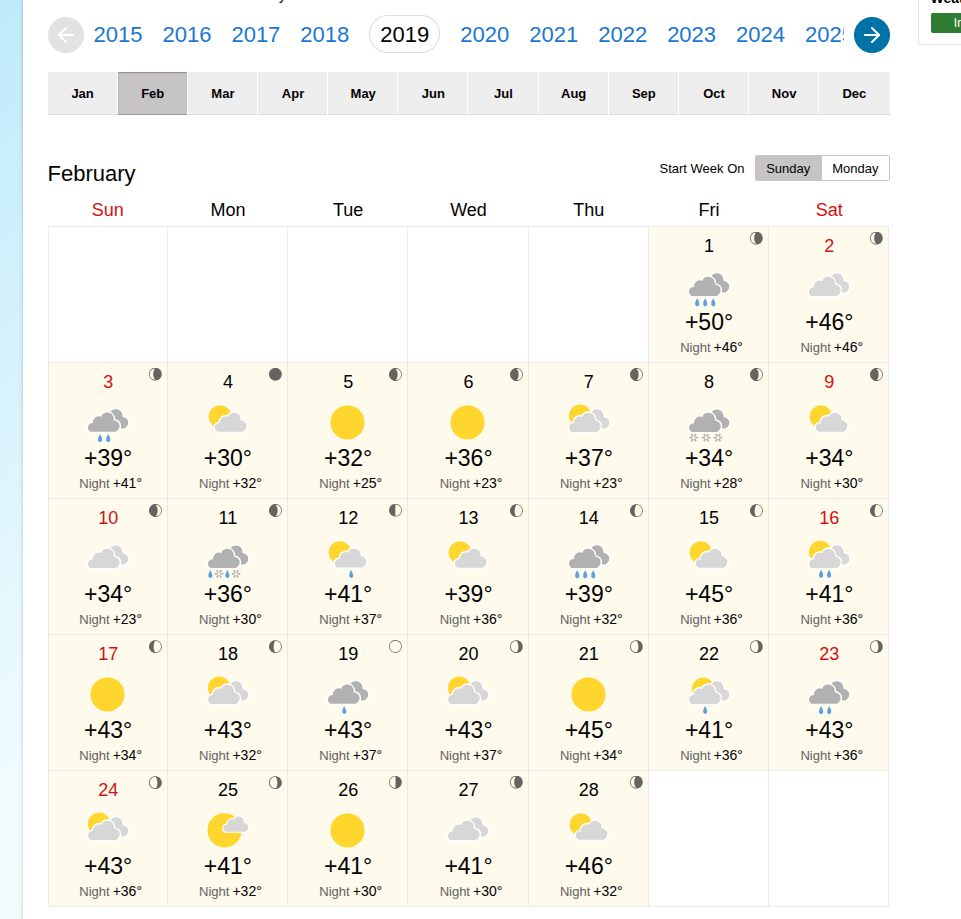

## Introduction

Seattle's open data portal provides a wealth of information about how people move around the city. In this post, I'll be exploring bike traffic data to identify interesting patterns and trends over time.

### Setup

We'll start by loading the necessary R packages.

```{r setup, message=FALSE}
library(tidyverse)
library(tsmp)
```

### Loading the Data

The data can be sourced from the [Seattle Open Data Portal](https://data.seattle.gov/). I'm using data from three bike counters - Fremont Bridge, Burke Gilman at NE 70th St, and the Elliott Bay Trail. I've personally ridden all of these numerous times. I've renamed the columns to be a bit easier to work with.

```{r load-data, output=FALSE}

fremont_bridge <- read_csv("fremont_bridge_bike.csv") |>
  setNames(c("date", "fremont_bike_total", "fremont_bike_north", "fremont_bike_south")) |>
  mutate(date = as_datetime(date, format = "%m/%d/%Y %r"))
elliott_bay <- read_csv("elliott_bike_trail.csv") |>
  setNames(c("date", "elliott_bike_total", "elliott_ped_north", "elliott_ped_south", "elliott_bike_north", "elliott_bike_south"))  |>
  mutate(date = as_datetime(date, format = "%Y %b %d %r")) 
burke_gilman <- read_csv("burke_gilman_north.csv") |>
  setNames(c("date", "burke_bike_total", "burke_ped_south", "burke_ped_north", "burke_bike_north", "burke_bike_south")) |>
  mutate(date = as_datetime(date, format = "%Y %b %d %r")) 

summary(fremont_bridge)
summary(elliott_bay)
summary(burke_gilman)
```

### Data Cleaning

The first thing I notice is some NA values. It's likely we'll want to limit the timeframe and decide a strategy to handle the NA values.

```{r initial-observations, output=FALSE}

min(fremont_bridge$date)
max(fremont_bridge$date)
min(elliott_bay$date)
max(elliott_bay$date)
min(burke_gilman$date)
max(burke_gilman$date)

start_date <- as_date("2018-01-01")
end_date <- as_date("2025-09-30")

fremont_bridge_subset <- fremont_bridge |>
  filter(date >= start_date & date <= end_date)
elliott_bay_subset <- elliott_bay |>
  filter(date >= start_date & date <= end_date)
burke_gilman_subset <- burke_gilman |>
  filter(date >= start_date & date <= end_date)

combined <- fremont_bridge_subset |>
  left_join(elliott_bay_subset, by = "date") |>
  left_join(burke_gilman_subset, by = "date")

summary(fremont_bridge_subset)
summary(elliott_bay_subset)
summary(burke_gilman_subset)


fremont_bridge_na <- fremont_bridge_subset |>
  filter(is.na(fremont_bike_total))
elliott_bay_na <- elliott_bay_subset |>
  filter(is.na(elliott_bike_total))
burke_gilman_na <- burke_gilman_subset |>
  filter(is.na(burke_bike_total))

```

The first strategy is to use the present data from that time to predict the missing values. The other values will take into account nuances of the day like weather, day of the week, patterns of remote work, and special events.


```{r interpolating_na}

fremont_north_formula <- fremont_bike_north ~ elliott_bike_north + burke_bike_north + elliott_bike_south + burke_bike_south
fremont_sourth_formula <- fremont_bike_south ~ elliott_bike_north + burke_bike_north + elliott_bike_south + burke_bike_south
burke_north_bike_formula <- burke_bike_north ~ elliott_bike_north + fremont_bike_north + elliott_bike_south + fremont_bike_south
burke_south_bike_formula <- burke_bike_south ~ elliott_bike_north + fremont_bike_north + elliott_bike_south + fremont_bike_south
elliot_north_bike_formula <- elliott_bike_north ~ fremont_bike_north + burke_bike_north + fremont_bike_south + burke_bike_south
elliot_south_bike_formula <- elliott_bike_south ~ fremont_bike_north + burke_bike_north + fremont_bike_south + burke_bike_south

model_fremont_north <- lm(fremont_north_formula, data = combined)
model_fremont_south <- lm(fremont_sourth_formula, data = combined)
model_burke_north <- lm(burke_north_bike_formula, data = combined)
model_burke_south <- lm(burke_south_bike_formula, data = combined)
model_elliot_north <- lm(elliot_north_bike_formula, data = combined)
model_elliot_south <- lm(elliot_south_bike_formula, data = combined)

combined_interpolated <- combined |> 
  mutate(fremont_bike_north = coalesce(fremont_bike_north, predict(model_fremont_north, newdata = pick(everything())) |> round(digits = 0))) |>
  mutate(fremont_bike_south = coalesce(fremont_bike_south, predict(model_fremont_south, newdata = pick(everything()))|> round(digits = 0))) |>
  mutate(burke_bike_north = coalesce(burke_bike_north, predict(model_burke_north, newdata = pick(everything()))|> round(digits = 0))) |>
  mutate(burke_bike_south = coalesce(burke_bike_south, predict(model_burke_south, newdata = pick(everything()))|> round(digits = 0))) |>
  mutate(elliott_bike_north = coalesce(elliott_bike_north, predict(model_elliot_north, newdata = pick(everything()))|> round(digits = 0))) |>
  mutate(elliott_bike_south = coalesce(elliott_bike_south, predict(model_elliot_south, newdata = pick(everything()))|> round(digits = 0))) |>
  select (-fremont_bike_total, -elliott_bike_total, -burke_bike_total, -burke_ped_north, -burke_ped_south, -elliott_ped_north, -elliott_ped_south)

```

To fill the remaining NAs I will use the average of the weekday, week, and hour of the other years.

```{r filling_remaining_nas}

combined_with_time <- combined_interpolated |>
  mutate(
    hour = hour(date),
    wday = wday(date),
    week = isoweek(date)
  )

# Calculate seasonal averages across all available years for each time slot
seasonal_averages <- combined_with_time |>
  group_by(week, wday, hour) |>
  summarise(
    across(contains("bike_"), \(x) mean(x, na.rm = TRUE)),
    .groups = "drop"
  ) |>
  rename_with(~paste0("avg_", .), contains("bike_"))

# Fill the remaining NAs with the rounded seasonal averages
final_combined <- combined_with_time |>
  left_join(seasonal_averages, by = c("week", "wday", "hour")) |>
  mutate(
    fremont_bike_north = coalesce(fremont_bike_north, round(avg_fremont_bike_north)),
    fremont_bike_south = coalesce(fremont_bike_south, round(avg_fremont_bike_south)),
    burke_bike_north = coalesce(burke_bike_north, round(avg_burke_bike_north)),
    burke_bike_south = coalesce(burke_bike_south, round(avg_burke_bike_south)),
    elliott_bike_north = coalesce(elliott_bike_north, round(avg_elliott_bike_north)),
    elliott_bike_south = coalesce(elliott_bike_south, round(avg_elliott_bike_south))
  ) |>
  select(-starts_with("avg_"), -week, -wday, -hour) |> 
  mutate(date = force_tz(date, tzone = "America/Los_Angeles"))

```

### Discords

The first thing I'm interested in is calculating a matrix profile. A matrix profile makes it easy to identify conserved patterns (motifs) and anomalous pattern (discords). There are both single variable and multi variable methods for calculating the matrix profile. For simplicity, I am just going to focus on the Fremont Bridge Southbound to see what comes up. The only parameter needed 

```{r matrix-profile, eval=FALSE}

mp <- tsmp::stamp(final_combined$fremont_bike_south, window_size = 24*7)

write(mp, "fremont_bike_south.mp")

```

```{r mp_discord}

mp <- read("fremont_bike_south.mp")

mp$mp <- replace_na(mp$mp, 0)

mp <- set_data(mp, final_combined$fremont_bike_south |> replace_na(0))
mp <- discords(mp, k = 10, neighbor_count = 0, radius = 200)

# Prepare for plotting
mp_values <- mp$mp
mp_padded <- c(mp_values, rep(NA, mp$w - 1))

final_combined_tall <- final_combined |>
  mutate(fremont_south_mp = mp_padded) |>
  select(date, fremont_bike_south, fremont_south_mp) |>
  pivot_longer(cols = c(fremont_bike_south, fremont_south_mp)) 
  

# Plot the results
ggplot(final_combined_tall, aes(x = date, y = value)) +
  geom_line() +
  facet_wrap(~name, ncol = 1, scales = "free_y") +
  theme_minimal() |>
  labs(title = "Fremont Bridge Southbound: Traffic and Matrix Profile",
       subtitle = "Peaks in the Matrix Profile (bottom) indicate anomalous weeks (discords)",
       y = "Value", x = "Date")

# Show dates of discords
cat("Top 10 Discord Dates:\n")
print(final_combined$date[unlist(mp$discord$discord_idx)])

```

So what can we see in those dates? The obvious insight is that biking is severely disrupted during the holidays. Another pattern is the early September. This is around when school starts and Labor day - Seattle's generally recognized end of summer activities.

Now what happened in February 8th 2019? Take a look at the weather that month:



That week was significant for heavy snow that would have found even the most resilient Seattle cyclists stuck at home by their fireplace.

October 5th 2020 - It's harder to pin down an exact reason for increased cycling activity. The weather was nice, but not unusually nice. The only other event I could find around that time was related to Black Lives Matter activity, particularly around the creation and preservation of the [murals in Capitol Hill](https://seattlecollegian.com/black-lives-matter-mural-from-community-effort-to-seattle-partnership/).

### Conclusion

Bike data is really interesting and can tell us things about what's happening in the city. A really powerful tool for time series analysis is the matrix profile. Calculating it makes finding both the obvious and the more subtle discords and motifs easy. 
